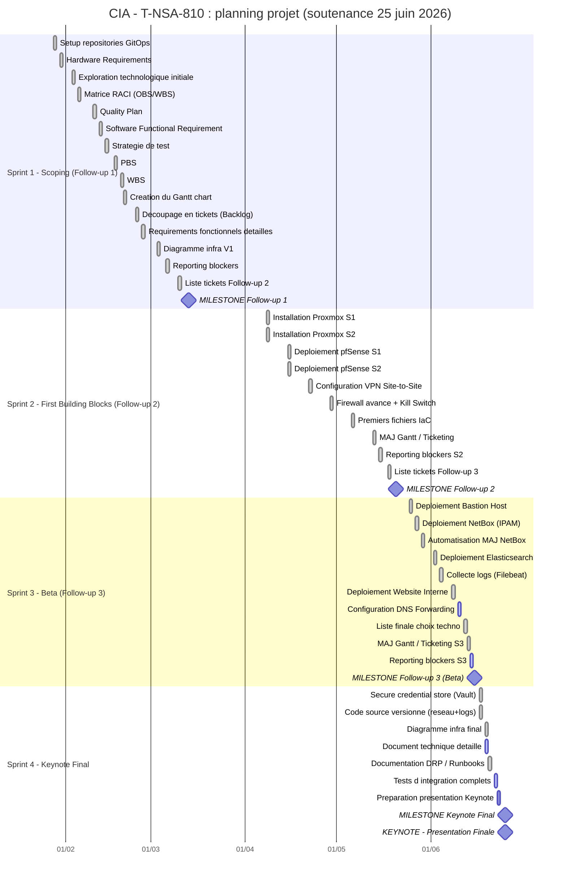

# Gantt - Projet CIA (T-NSA-810)

> Généré depuis le suivi ClickUp (source de vérité du planning).
> Soutenance : **25 juin 2026**. Rendu GitHub-natif (mermaid).

```mermaid
gantt
    title CIA - T-NSA-810 : planning projet (soutenance 25 juin 2026)
    dateFormat YYYY-MM-DD
    axisFormat %d/%m

    section Sprint 1 - Scoping (Follow-up 1)
    Setup repositories GitOps                    :done, 2026-01-28, 1d
    Hardware Requirements                        :done, 2026-01-30, 1d
    Exploration technologique initiale           :done, 2026-02-03, 1d
    Matrice RACI (OBS/WBS)                       :done, 2026-02-05, 1d
    Quality Plan                                 :done, 2026-02-10, 1d
    Software Functional Requirement              :done, 2026-02-12, 1d
    Strategie de test                            :done, 2026-02-14, 1d
    PBS                                          :done, 2026-02-17, 1d
    WBS                                          :done, 2026-02-19, 1d
    Creation du Gantt chart                      :done, 2026-02-20, 1d
    Decoupage en tickets (Backlog)               :done, 2026-02-24, 1d
    Requirements fonctionnels detailles          :done, 2026-02-26, 1d
    Diagramme infra V1                           :done, 2026-03-03, 1d
    Reporting blockers                           :done, 2026-03-06, 1d
    Liste tickets Follow-up 2                    :done, 2026-03-10, 1d
    MILESTONE Follow-up 1                        :milestone, 2026-03-13, 1d

    section Sprint 2 - First Building Blocks (Follow-up 2)
    Installation Proxmox S1                      :done, 2026-04-08, 1d
    Installation Proxmox S2                      :done, 2026-04-08, 1d
    Deploiement pfSense S1                       :done, 2026-04-15, 1d
    Deploiement pfSense S2                       :done, 2026-04-15, 1d
    Configuration VPN Site-to-Site               :done, 2026-04-22, 1d
    Firewall avance + Kill Switch                :done, 2026-04-29, 1d
    Premiers fichiers IaC                        :done, 2026-05-06, 1d
    MAJ Gantt / Ticketing                        :done, 2026-05-13, 1d
    Reporting blockers S2                        :done, 2026-05-15, 1d
    Liste tickets Follow-up 3                    :done, 2026-05-18, 1d
    MILESTONE Follow-up 2                        :milestone, 2026-05-20, 1d

    section Sprint 3 - Beta (Follow-up 3)
    Deploiement Bastion Host                     :done, 2026-05-25, 1d
    Deploiement NetBox (IPAM)                    :done, 2026-05-27, 1d
    Automatisation MAJ NetBox                    :done, 2026-05-29, 1d
    Deploiement Elasticsearch                    :done, 2026-06-02, 1d
    Collecte logs (Filebeat)                     :done, 2026-06-04, 1d
    Deploiement Website Interne                  :done, 2026-06-08, 1d
    Configuration DNS Forwarding                 :active, 2026-06-10, 1d
    Liste finale choix techno                    :done, 2026-06-12, 1d
    MAJ Gantt / Ticketing S3                     :done, 2026-06-13, 1d
    Reporting blockers S3                        :active, 2026-06-14, 1d
    MILESTONE Follow-up 3 (Beta)                 :milestone, 2026-06-15, 1d

    section Sprint 4 - Keynote Final
    Secure credential store (Vault)              :done, 2026-06-17, 1d
    Code source versionne (reseau+logs)          :done, 2026-06-17, 1d
    Diagramme infra final                        :done, 2026-06-19, 1d
    Document technique detaille                  :active, 2026-06-19, 1d
    Documentation DRP / Runbooks                 :done, 2026-06-20, 1d
    Tests d integration complets                 :active, 2026-06-22, 1d
    Preparation presentation Keynote             :2026-06-23, 1d
    MILESTONE Keynote Final                      :milestone, 2026-06-25, 1d
    KEYNOTE - Presentation Finale                :milestone, 2026-06-25, 1d

```
